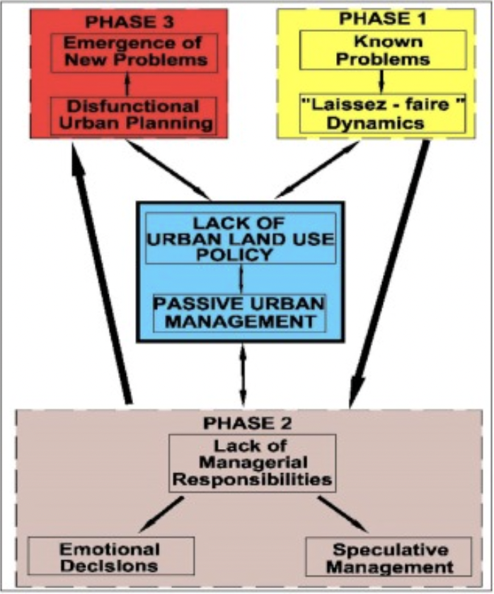
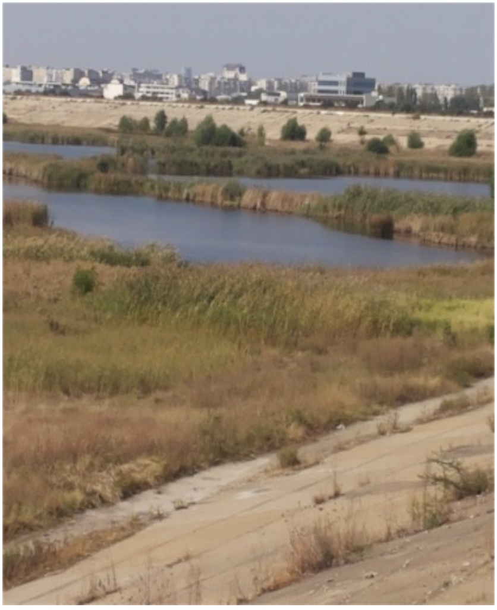
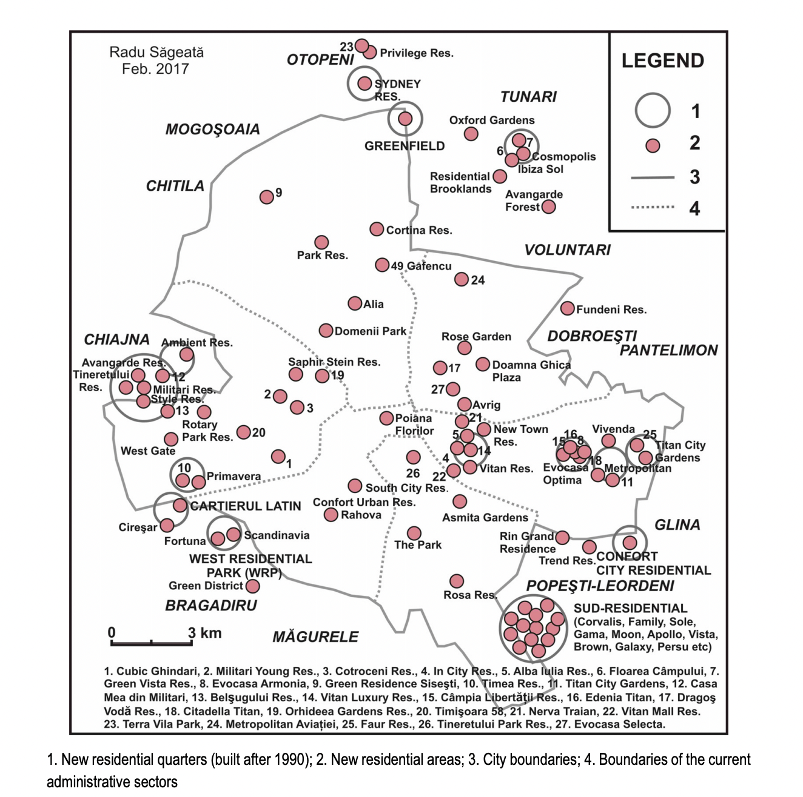
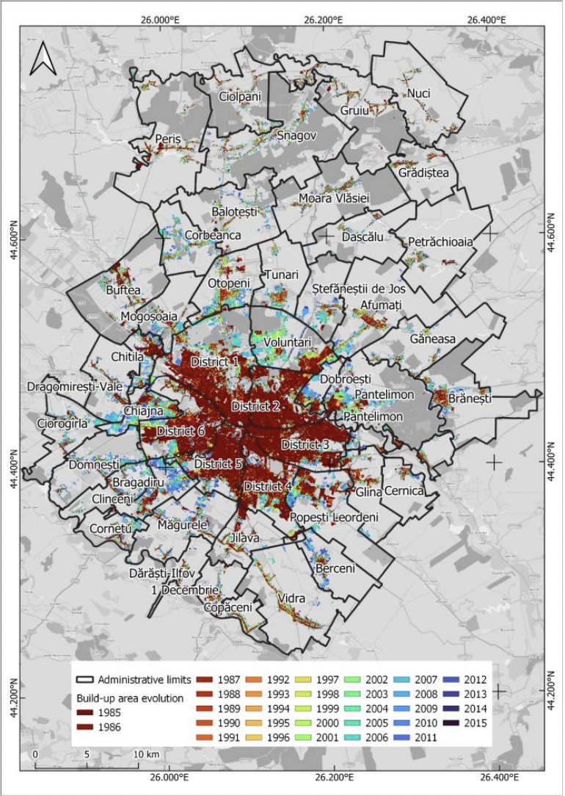
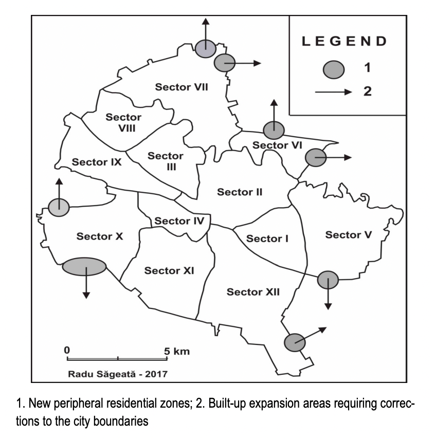
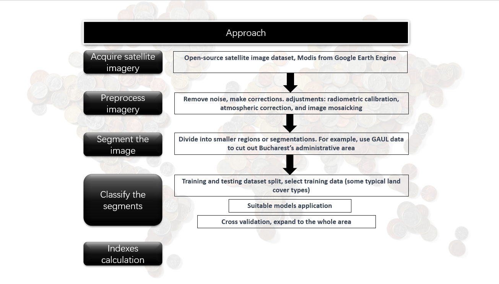
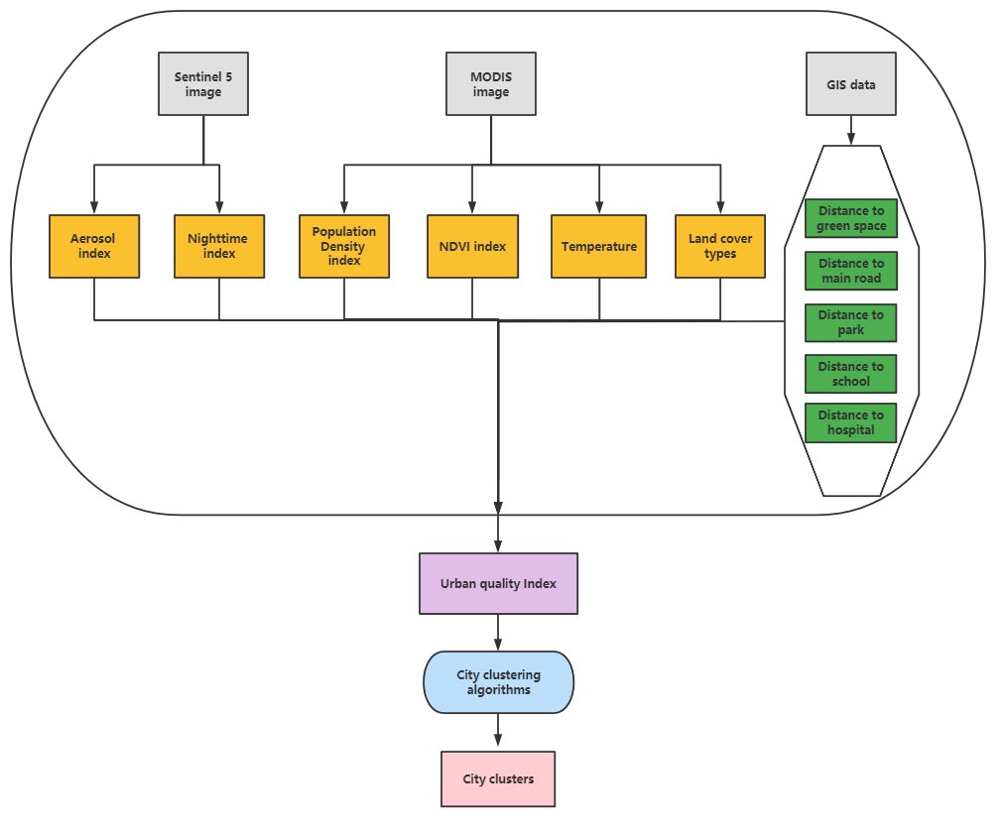
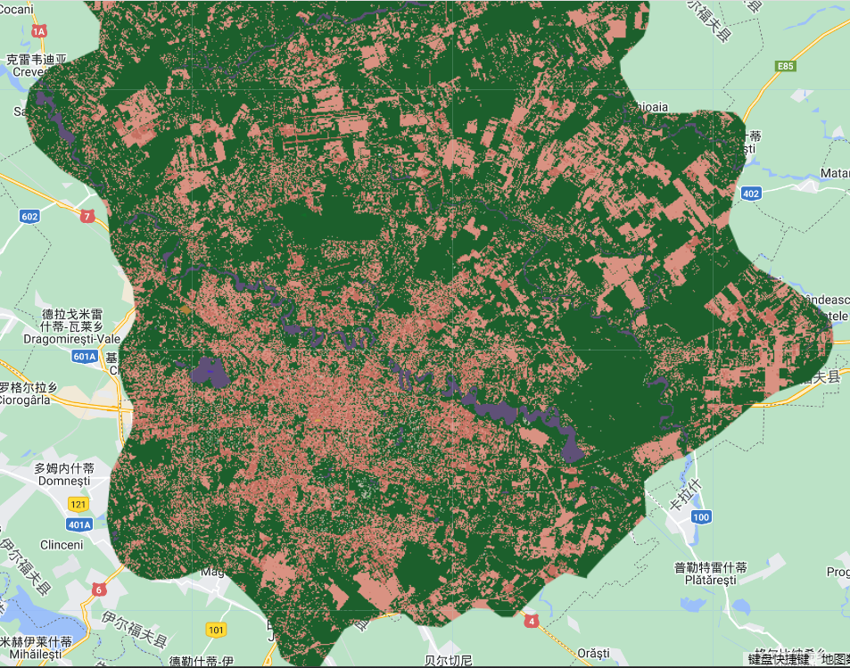
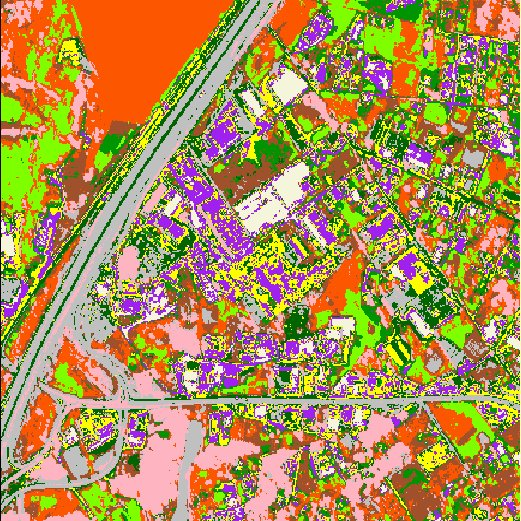
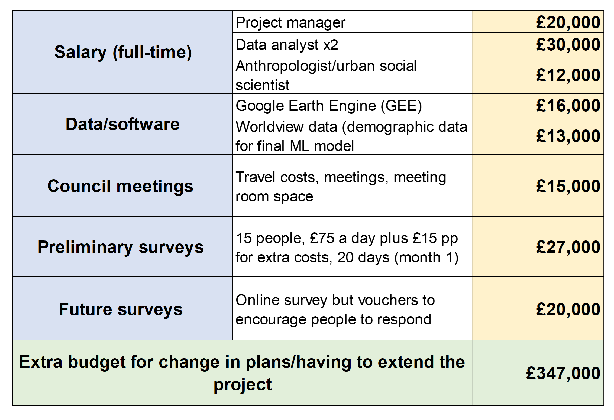

```{r setup, include=FALSE}
options(htmltools.dir.version = FALSE)
# xaringan:::list_css()
```

```{r xaringan-all, echo=FALSE}
library(countdown)
library(xaringan)
library(xaringanExtra)
library(knitr)
hook_source <- knitr::knit_hooks$get('source')
knitr::knit_hooks$set(source = function(x, options) {
  x <- stringr::str_replace(x, "^[[:blank:]]?([^*].+?)[[:blank:]]*#<<[[:blank:]]*$", "*\\1")
  hook_source(x, options)
})
xaringanExtra::use_broadcast()
xaringanExtra::use_freezeframe()
xaringanExtra::use_scribble()
#xaringanExtra::use_slide_tone()
xaringanExtra::use_search(show_icon = TRUE, auto_search	=FALSE)
xaringanExtra::use_freezeframe()
xaringanExtra::use_clipboard()
xaringanExtra::use_tile_view()
xaringanExtra::use_panelset()
xaringanExtra::use_editable(expires = 1)
xaringanExtra::use_fit_screen()
xaringanExtra::use_extra_styles(
  hover_code_line = TRUE,         
  mute_unhighlighted_code = TRUE  
)
```

class: center, title-slide, middle

background-image: url("images/base2.png")
background-size: cover
background-position: center


<style>
.title-slide{
  text-align: center
}
</style>
```{r load_packages, message=FALSE, warning=FALSE, include=FALSE}
library(fontawesome)
```

# Improving urban quality of life in Bucharest

## An analysis of urban structuring and administrative division adjustments using remotely sensed data


`r fa("location-dot", fill = "white")` [<span style="color:white;text-shadow: -1px -1px orange, 1px 1px orange">**Department of Geography**</span>](https://www.geog.ucl.ac.uk/) .my-style[&] [<span style="color:white;text-shadow: -1px -1px orange, 1px 1px orange">**Center for Advanced Spatial Analysis**</span>](https://www.ucl.ac.uk/bartlett/casa/) .my-style[UCL]


<a href="https://github.com/vtesniere/CASA0023_geographers_presentation" class="github-corner" aria-label="View source on GitHub"><svg width="80" height="80" viewBox="0 0 250 250" style="fill:#fff; color:#151513; position: absolute; top: 0; border: 0; left: 0; transform: scale(-1, 1);" aria-hidden="true"><path d="M0,0 L115,115 L130,115 L142,142 L250,250 L250,0 Z"></path><path d="M128.3,109.0 C113.8,99.7 119.0,89.6 119.0,89.6 C122.0,82.7 120.5,78.6 120.5,78.6 C119.2,72.0 123.4,76.3 123.4,76.3 C127.3,80.9 125.5,87.3 125.5,87.3 C122.9,97.6 130.6,101.9 134.4,103.2" fill="currentColor" style="transform-origin: 130px 106px;" class="octo-arm"></path><path d="M115.0,115.0 C114.9,115.1 118.7,116.5 119.8,115.4 L133.7,101.6 C136.9,99.2 139.9,98.4 142.2,98.6 C133.8,88.0 127.5,74.4 143.8,58.0 C148.5,53.4 154.0,51.2 159.7,51.0 C160.3,49.4 163.2,43.6 171.4,40.1 C171.4,40.1 176.1,42.5 178.8,56.2 C183.1,58.6 187.2,61.8 190.9,65.4 C194.5,69.0 197.7,73.2 200.1,77.6 C213.8,80.2 216.3,84.9 216.3,84.9 C212.7,93.1 206.9,96.0 205.4,96.6 C205.1,102.4 203.0,107.8 198.3,112.5 C181.9,128.9 168.3,122.5 157.7,114.1 C157.9,116.9 156.7,120.9 152.7,124.9 L141.0,136.5 C139.8,137.7 141.6,141.9 141.8,141.8 Z" fill="currentColor" class="octo-body"></path></svg></a><style>.github-corner:hover .octo-arm{animation:octocat-wave 560ms ease-in-out}@keyframes octocat-wave{0%,100%{transform:rotate(0)}20%,60%{transform:rotate(-25deg)}40%,80%{transform:rotate(10deg)}}@media (max-width:500px){.github-corner:hover .octo-arm{animation:none}.github-corner .octo-arm{animation:octocat-wave 560ms ease-in-out}}</style>


---
class: left
background-size: cover
# Background of Bucharest

.medium[
- Bucharest is a city in transition from its communist past to a market economy
- **Problems**: 
  - Lack of effective and strictly enforced regulation and public sector indecision
  - Problems inherited from the Ceausescu regime
  - Example of poor urban planning and management

- Complex structural change following the end of the socialist regime which led to implementation of specific urban policy decisions not adequate for the current real-estate market development (Nistor et al., 2021)

- Transition from a centrally planned communist economic and political structure to its polar opposite, a free-market investment heavy real-estate market (Oliver, 2014)
]


---
# Examples of bad urban planning in Bucharest

.panelset[
.panel[ .panel-name[**No unified planning, fragmented communication**]

- Văcăreşti “Lake” ([Ianos et al., 2017](https://www.sciencedirect.com/science/article/pii/S026483771630374X)) illustrates the effects of negligent communication between government authorities (local, metropolitan and national)
- Leads to projects that are **unfinished** and **inconsistent** with contemporary development needs 

.space[.pull-left[
- Artificial Lake created to regulate water levels and provide a space of leisure for the neighbouring population
- Now abandoned by the Romanian Government 
  → became swampland and sparsely vegetated area 
]]
.pull-right[
```{r echo=FALSE, out.width="70%"}

```

.small[Understading why [Bucharest Planning](https://www.sciencedirect.com/science/article/pii/S026483771630374X) is inefficient]
]

.panel[ .panel-name[**Evidence of bad planning**]

.pull-left[
```{r echo=FALSE, out.width="100%"}
knitr::include_graphics("images/planned_vacaresti.png")
```

.small[Plan of what the Vacaresti reservoir was supposed to look like]
]
.pull-right[
```{r echo=FALSE, out.width="80%"}

```

.small[Real image of what Vacaresti looks like currently]
]
]
]]

---
class: center, left
background-size: cover
# Sectorial changes in history
```{r echo=FALSE, results='asis', out.wodthecho=FALSE}
xfun::file_string('sector_history.html')
```

```{r echo=FALSE, out.width='100%', fig.align='center'}
knitr::include_graphics('images/transformation.png')
```
---
class: left
background-size: cover
# Sectorial problems
.medium[
Previous social, economic and political changes made Romania vulnerable and inconsistent in land use planning legislation
]
.pull-left[
.medium[
  - Voiding previous land use planning laws
- Failing to replace with adequate new system 
- Retaining a flawed land use system 
- fragmentation of society into contesting groups of self-interested citizens ]
(Ianoş, Sorensen and Merciu, 2017) ]

.pull-right[
.orange[Demographic and functional discontinuities: gated communities]


```{r echo=FALSE, out.width='90%', fig.align='center'}

```
]
---
class: left
# How can redefining sectorial boundaries improve uQOL?
.pull-left[
```{r echo=FALSE, out.height=400, out.width=600, fig.align='left'}
knitr::include_graphics('https://www.mdpi.com/urbansci/urbansci-02-00073/article_deploy/html/images/urbansci-02-00073-g001.png')
```
.small[The physical and social spheres associated with [quality of life and inclusive place](https://www.mdpi.com/2413-8851/2/3/73) in a neighbourhood]
]

--
.pull-right[ .medium[ 
- A mutually reciprocal relationship between aspects of quality of life and urban spatial structure (Romice et al., [2017](https://eprints.whiterose.ac.uk/94853/2/14-Romice-Pasino_HandbookQOL%20OCT15.pdf))
- Revising sectorial boundaries allow appropriate level of planning within the sector, less social conflicts
- Promote the efficient use of land, public facilities and services inside the boundary
]]
---
class: left
background-size: cover
# Objectives of the project
.medium[
- A top down novel approach to improve urban quality of life through reconstructing sector boundaries
  - decision-making process occurs at the highest level →communicated to the rest of the components
- Revise current sectorial boundaries in Bucharest
- Expand urban boundaries to enhance urban functioning, urban quality of life in long term
```{r echo=FALSE, cache=FALSE,fig.align='center', out.height=200 }
knitr::include_graphics('https://dam-api.bfs.admin.ch/hub/api/dam/assets/1481139/thumbnail?width=555&height=555')
```
.smallcenter[Principles of [Urban Quality of Life](https://www.researchgate.net/figure/Urban-quality-of-life-dimensions-Heptagon-Shape-the-researcher-2012_fig1_257681106) in a neighbourhood]

- Provide evidence-based suggestions on redefining sectorial boundaries in Bucharest
]
---
- Recovery and Resiliency Plan for Romania unlocking funds for the development of the country - [7 Billion Euros unlocked for Climate Specific improvements](https://commission.europa.eu/business-economy-euro/economic-recovery/recovery-and-resilience-facility/recovery-and-resilience-plan-romania_en)
- If the communication and implementation of these policies are not efficiently put, **what is the point of having these funds ?**

--

.center[ .medium[**Two Current Appraoches similar to our project which focus on Bucharest**]]

--

.panelset[
.panel[ .panel-name[Urban Development]
.space[.pull-left[ 
- Proposed by [Lazar et al, 2022](https://www.int-arch-photogramm-remote-sens-spatial-inf-sci.net/XLIII-B3-2022/641/2022/isprs-archives-XLIII-B3-2022-641-2022.pdf)
- Urban Expansion at very high rates
- Also characterised by uncoordinated urban development
- Example by the [Stoica et al. 2021](https://www.mdpi.com/2072-4292/13/19/3969) paper where they use Landsat imagery to analyse the expansion of the urban areas around Bucharest

<br/>

.small[
&emsp;&emsp;&emsp;&emsp;&emsp; Bucharest city evolution by [Lazar et al.](https://www.rtsa.ro/tras/index.php/tras/article/viewFile/589/575) 1985-2022 →]
]]
.pull-right-more[
```{r echo=FALSE, out.width="60%"}

```
]
]
.panel[ .panel-name[Proposal for new Bucharest Districts]
.pull-left[ .space[

- Proposed by [Radu, 2019](https://www.rtsa.ro/tras/index.php/tras/article/viewFile/589/575)
- Based on the changing the radial-concentric
- Calls for the revisit of current administrative boundaries and establish multi-core sectors to address discontinuity
]
]
.pull-right-more[
.small[Bucharest city delimitation by [Radu](https://www.rtsa.ro/tras/index.php/tras/article/viewFile/589/575) in 2017]
```{r echo=FALSE, out.width="70%"}

```
]
]
]
---
class: center
background-size: cover
### Nightlights in Bucharest - Evolution!


 .small[Bucharest VIIRS evolution: 2014-2022]    
---
class: left
background-size: cover
# Approach
### data
.milieu3[
```{r include=FALSE}
data1<-read.csv(file = 'assets/data.csv',header = TRUE)
colnames(data1) <- c('Reference to UQoL indicators', 'What data','Sensors','Spatial resolution')
library(dplyr)
```
```{r echo=FALSE}
data1%>%
  knitr::kable(format = "html")
```
]
---
# Approach - continue


 .small[approach]
---
# Workflow



---
# Output of approaches

```{r xaringan-panelset, echo=FALSE}
xaringanExtra::use_panelset()
```

.panelset[
.panel[.panel-name[Land cover type]

```{r echo=FALSE}
xaringanExtra::style_panelset_tabs(foreground = "honeydew", background = "seagreen")
```


.pull-left[
    
    Land cover type of Bucharest
    
]

.pull-right[
- This is a map of land cover distribution in Bucharest obtained using random forest created by GEE.

- The map clearly distinguishes between urban areas, water bodies, green spaces and other land types, but whether the model is accurate or not, we can use confusion matrix to validate. 

- Furthermore, if this machine learning model is not accurate, a local survey can also be conducted to determine the urban boundary.
]
]

.panel[.panel-name[Cluster map]

.pull-left[


- We can use land cover type data or NDVI or temperature to apply city clustering algorithm (ISODATA algorithm, an enhanced clustering algorithm), then generate a cluster map.

- Based on this, We can know what category a sample point has been divided into, and return back to map, we can determine the boundaries of the city.

- Here is an output example of ISODATA cluster map:

]

.pull-right[


  
  Cluster_example
  
]
]

]

---
class: center, middle

# Project plan and timeline - 4 month plan

---
class:center, middle

### Collect data

--
## ↓

### Refine Focus

--
## ↓

### Understand population and City needs

--
## ↓

### Modelling

--
## ↓

### Boundary validation 

---

background-size: cover
# Project Plan Breakdown

.medium[ .smallspace[ .panelset[
.panel[ .panel-name[**Month 1**]
<br/>
- Collecting data

- Leading population surveys to understand their perspectives

- Preliminary council meetings

- Refine focus and what is important to ensure needs are met 

]
.panel[ .panel-name[**Month 2**]
<br/>
- Pilot study

- Preliminary modelling

- Continuous discussion with the city council

]
.panel[ .panel-name[**Month 3**]
<br/>
- Carry out modelling across the whole city

- Continuous discussion with the city council

]
.panel[ .panel-name[**Month 4**]
<br/>
- Finalise plans

- Validate boundaries

- Provide full output production 

]
.panel[ .panel-name[**Further Steps**]

- Quarterly surveys for 3 years to understand:
  - How local population react to the new boundaries/districts
  - If implementation of policies and communication between district has become better
- If the project is not completed within 4 months the timeline can be extended to accommodate this 
- If implementation successful, we can use framework for use in other cities
  - provides reproducible modelling and output which, when adapted, can benefit other cities

]
]
]
]
---
class: left
background-size: cover
# Cost Breakdown - Value for money

.center[
```{r, echo=FALSE, out.width="65%"}

```
].small.center[**Breakdown of Costs for the project**]

.pull-left[
- Understanding the population’s needs
- Open source data 
- Return on investment - one time cost of data analysis
- Using [Worldview](https://aws.amazon.com/marketplace/pp/prodview-h7qawudun3pcw?sr=0-70&ref_=beagle&applicationId=AWSMPContessa#offers) for Bucharest Demographic

]

.pull-right[
- Low overall costs and benefit of better resource management
  - Savings on future urban development
  - Improved health and well-being 
- Higher quality of life can increase investment and economic value   

]
---

# Limitation, Risks and Migitations

.space[ .panelset[
.panel[ .panel-name[.center[Modelling Limitations]]

.bigger[**Issue**]
.medium[ - Modelling might fail
- Machine learning might not be useful 
]
.bigger[**Proposed Fix**]
.medium[ - Taking a more manual angle by overlaying land usage with night time imagery
- Using population density to validate boundaries
]
]
.panel[ .panel-name[Physical Limitations]
.bigger[**Issue**]
.medium[ - New boundaries produced by the model may not be convenient
- Might cross private property, protected spaces which make implementation more difficult
]
.bigger[**Proposed Fix**]
.medium[ - Expert Opinion from Anthropological Consultant to account for feasibility of such implementation and in accordance with the preferences of local populations
- Flexibility on the boundary definition
]
]
.panel[ .panel-name[Immediate Project Potential Limitations]
.bigger[**Issue**]
.medium[ - Differences in opinion of stakeholders and population
- Less clear return on investment/more time needed
- Difficulty combining data sources to define boundaries  
]
.bigger[**Proposed Fix**]
.medium[- Project costs are fairly low
- Remaining budget for extending the plan if needed and taking time to create new models
- Discuss outputs with stakeholders 
]
]
]
]
---

# Future work, contributions and effects

.space[

- After trial period (1 year) restults are estimated to start appearing
  - If successful **can be applied to other cities !**

- Incorporated into SDG's healthy cities and healthy lives framework

- **Further analysis possible:**

  - time series could be incorporated to allow for prediction of urban growth
  - record where boundaries might need to be in the future
  - using framework in other countries/cities with **similar characteristics**
  
- Anticipate urban growth and change

]
---
# References

- Săgeată, R., Institute of Geography, Romanian Academy, Bucharest, Romania, rsageata@gmail.com", and Radu Săgeată. ‘A Proposal for a New Administrative-Territorial Outline of Bucharest-Based in-City Discontinuities’. Transylvanian Review of Administrative Sciences, no. 56E (28 February 2019): 77–96. https://doi.org/10.24193/tras.56E.5.

- Alpopi, Cristina, Ștefan-Gabriel Burcea, and Ruxandra-Irina Popescu. ‘ANALYSIS OF URBAN PLANNING IN BUCHAREST. CURRENT AND FUTURE CHALLENGES’, 2021.

- Cabrera-Barona, Pablo F., and Helena Merschdorf. ‘A Conceptual Urban Quality Space-Place Framework: Linking Geo-Information and Quality of Life’. Urban Science 2, no. 3 (September 2018): 73. https://doi.org/10.3390/urbansci2030073.

- Ianoş, Ioan, Anthony Sorensen, and Cristina Merciu. ‘Incoherence of Urban Planning Policy in Bucharest: Its Potential for Land Use Conflict’. Land Use Policy 60 (1 January 2017): 101–12. https://doi.org/10.1016/j.landusepol.2016.10.030.

- Lazar, A. M., I. F. Dana Negula, C. Moise, F. Dediu, C. E. Mihalache, and A. Badea. ‘ANALYSIS OF BUCHAREST URBAN DEVELOPMENT BASED ON MULTITEMPORAL SATELLITE-DERIVED DATASETS AND STATISTICAL DATA’. The International Archives of the Photogrammetry, Remote Sensing and Spatial Information Sciences XLIII-B3-2022 (30 May 2022): 641–48. https://doi.org/10.5194/isprs-archives-XLIII-B3-2022-641-2022.

---

# References - Continued

- Nistor, Constantin, Marina Vîrghileanu, Irina Cârlan, Bogdan-Andrei Mihai, Liviu Toma, and Bogdan Olariu. ‘Remote Sensing-Based Analysis of Urban Landscape Change in the City of Bucharest, Romania’. Remote Sensing 13, no. 12 (January 2021): 2323. https://doi.org/10.3390/rs13122323.

- Romice, Ombretta, Kevin Thwaites, Sergio Porta, Mark Greaves, Gordon Barbour, and Paola Pasino. ‘Urban Design and Quality of Life’. In Handbook of Environmental Psychology and Quality of Life Research, edited by Ghozlane Fleury-Bahi, Enric Pol, and Oscar Navarro, 241–73. International Handbooks of Quality-of-Life. Cham: Springer International Publishing, 2017. https://doi.org/10.1007/978-3-319-31416-7_14.

- Serag El Din, Hamam, Ahmed Shalaby, Hend Elsayed Farouh, and Sarah A. Elariane. ‘Principles of Urban Quality of Life for a Neighborhood’. HBRC Journal 9, no. 1 (1 April 2013): 86–92. https://doi.org/10.1016/j.hbrcj.2013.02.007.

- Stoica, Ilinca-Valentina, Daniela Zamfir, and Marina Vîrghileanu. ‘Evaluating the Territorial Impact of Built-Up Area Expansion in the Surroundings of Bucharest (Romania) through a Multilevel Approach Based on Landsat Satellite Imagery’. Remote Sensing 13, no. 19 (January 2021): 3969. https://doi.org/10.3390/rs13193969.


